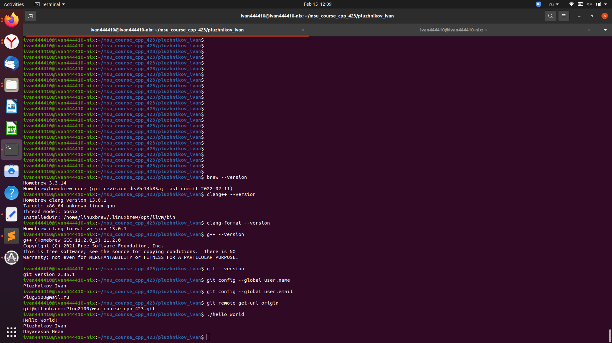

# Pluzhnikov Ivan
# Плужников Иван

The task of the workshop is to use C++ 17 tools and object-oriented programming to write a game that will play itself. What we should get in the end:
A playing field representing a graph (tree).
    At the beginning of this field is a knight.
    At the end of this field is the princess.
    The transition between the cells of the playing field (the vertices of the graph) takes some time.

